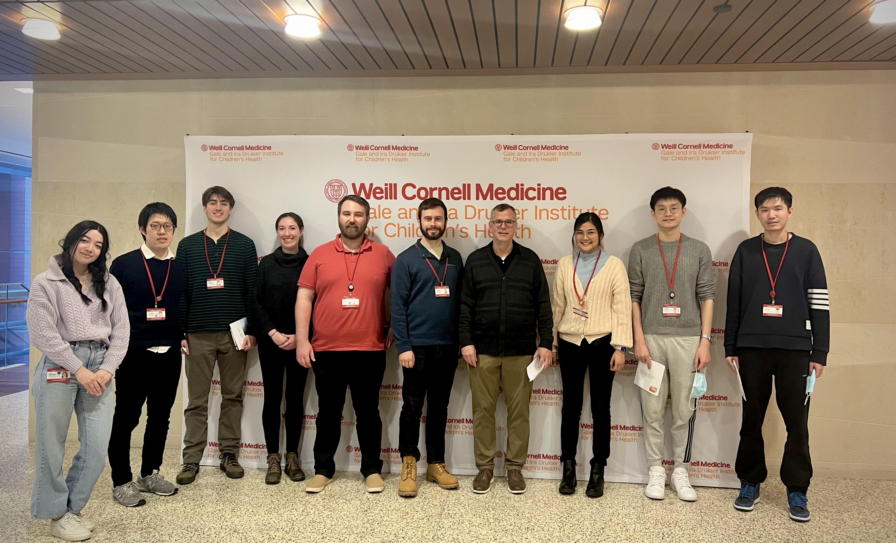

On February 13, 2024, the Wilson Lab attended the 2024 Gale and Ira Drukier Lecture in Children's Health, featuring Carola Vinuesa, M.D., Ph.D., who spoke about "The B Cell's Tale".  Sumit Gupta, M.D., Ph.D., the 2023 recipient of the Gale and Ira Drukier Prize in Children's Health Research, also gave a presnetation titled "Using Data to Improve Cancer Outcomes".

_From left to right: Tomi, Atsu, Dewey, Jordan, Josh, Sean, Patrick, Siri, Yanbin, Jiayi_

